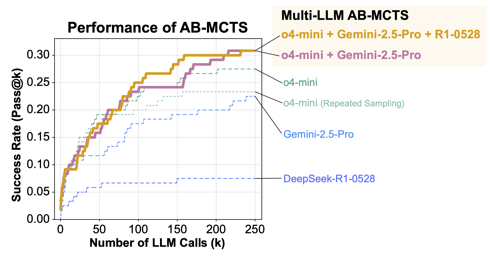

# Multi-LLM AB-MCTS for ARC-AGI-2
[![Paper](https://img.shields.io/badge/arXiv-2503.04412-B31B1B?logo=data:image/svg+xml;base64,PHN2ZyBpZD0ibG9nb21hcmsiIHhtbG5zPSJodHRwOi8vd3d3LnczLm9yZy8yMDAwL3N2ZyIgdmlld0JveD0iMCAwIDE3LjczMiAyNC4yNjkiPjxnIGlkPSJ0aW55Ij48cGF0aCBkPSJNNTczLjU0OSwyODAuOTE2bDIuMjY2LDIuNzM4LDYuNjc0LTcuODRjLjM1My0uNDcuNTItLjcxNy4zNTMtMS4xMTdhMS4yMTgsMS4yMTgsMCwwLDAtMS4wNjEtLjc0OGgwYS45NTMuOTUzLDAsMCwwLS43MTIuMjYyWiIgdHJhbnNmb3JtPSJ0cmFuc2xhdGUoLTU2Ni45ODQgLTI3MS41NDgpIiBmaWxsPSIjYmRiOWI0Ii8+PHBhdGggZD0iTTU3OS41MjUsMjgyLjIyNWwtMTAuNjA2LTEwLjE3NGExLjQxMywxLjQxMywwLDAsMC0uODM0LS41LDEuMDksMS4wOSwwLDAsMC0xLjAyNy42NmMtLjE2Ny40LS4wNDcuNjgxLjMxOSwxLjIwNmw4LjQ0LDEwLjI0MmgwbC02LjI4Miw3LjcxNmExLjMzNiwxLjMzNiwwLDAsMC0uMzIzLDEuMywxLjExNCwxLjExNCwwLDAsMCwxLjA0LjY5QS45OTIuOTkyLDAsMCwwLDU3MSwyOTNsOC41MTktNy45MkExLjkyNCwxLjkyNCwwLDAsMCw1NzkuNTI1LDI4Mi4yMjVaIiB0cmFuc2Zvcm09InRyYW5zbGF0ZSgtNTY2Ljk4NCAtMjcxLjU0OCkiIGZpbGw9IiNiMzFiMWIiLz48cGF0aCBkPSJNNTg0LjMyLDI5My45MTJsLTguNTI1LTEwLjI3NSwwLDBMNTczLjUzLDI4MC45bC0xLjM4OSwxLjI1NGEyLjA2MywyLjA2MywwLDAsMCwwLDIuOTY1bDEwLjgxMiwxMC40MTlhLjkyNS45MjUsMCwwLDAsLjc0Mi4yODIsMS4wMzksMS4wMzksMCwwLDAsLjk1My0uNjY3QTEuMjYxLDEuMjYxLDAsMCwwLDU4NC4zMiwyOTMuOTEyWiIgdHJhbnNmb3JtPSJ0cmFuc2xhdGUoLTU2Ni45ODQgLTI3MS41NDgpIiBmaWxsPSIjYmRiOWI0Ii8+PC9nPjwvc3ZnPg==)](https://arxiv.org/abs/2503.04412)
[![Blog](https://img.shields.io/badge/Blog-Sakana%20AI-blue?logo=data:image/png;base64,iVBORw0KGgoAAAANSUhEUgAAADAAAAAwCAYAAABXAvmHAAAFXElEQVRoge2XW4yV1RXHf+s751v7zDlnwAnMKNgRCOUmBi/BYipNG2MTrKaRanyxqdUH+sCTb5poYrz0og8afWjqQ9OkCbZAkza0pU0sA0RroiZ4GQtmZphvf+coUGC4zIU5l+9bfZghJQPMnDnDmCY9v8dvr732+q9v77XXhhYtWrRo0aJFi/9fZD6dG2SPQqFYIJckuBpkAyMwsERIMgHV0QyV3DCjy6EiYLNd45oLMMgcVW7OBtwRpKxLYSWwFOhEKABqkIoxanAW4YSkRAR8jtCbZuhdPsqJRsVcMwG9oAuU+0zYjrEO6ADyF9cQOGcwBIwahCIsFKPTIDPpoopwHuOMwadBwJ7ucXYIVOdNgIHEcF3i2JwxngXuNKgJnBLwQE8iHKTCR8u5PKvHoTCaZ10m4S4x7gXWAx0CCw2yCE8uq/DavAj4EMJOxxYznhDYAgQI7xrsDVL2S43ebrjQqD8DKeVZYnW+CfwUWCWw9aYqf2w2xqtSdqyOHLu8ctorqVfMK/88WuB6g2AuvmPHSq986ZULR6B9JvuGFzMIjha4PgrZnsB+MR5GqItwEBgGlgVVbhRI5yKAiW20BOHA2gm/09KQgCPQXsrxo0ydXSK8gZEX2IHwqDh+gPAJsEgCNtvcz9UDAAJ7GrHPzmRQCvmGwcuWcgfQjvAZ8FRbhQOdMMw4lBx/SuFuMW49Bm3AWDPB94ET2GowXDMOzlnAgGNVauwEugXKwCtJhVdWwPildkmGt6UOqbByrEiRkeYEOGWrGYsRevIhx6cvoA0IcMpQWmW3pWRS+O37NT5+BJKpdjbGYZSaGF1tCa6Z4I9AuwnbMOoYB24Y4Uwj86YV8LVhTpfg2QRsatYvZQWMR8KQQKFmM2/LK9Hm+A7GbcDJxNgrUG9k3oyHuBsuXBq8QWYQciVoM9DnJn00uuCVGICFGD8EOgz+saLGB43ObShb/UW6tMbtkrImEm4MhAUpZD2MP26c/nFATMoCgy/CYPZCQuV7BvchHEvg+dk0ddOWvMEcyzPGdjMeZKK3aQd0ipkxcePmBYZSeHVkIa/dcpKRRgLod3w9hHcwFoux7aYav240+GkFlJVH6sIbYnQBI8ApjH6EQwhlJtrfvMEaM7YILJsUIwhejKdzVfZ0cXUhcZ6lVmc3sCmAPxSrbOuAs7MRcNUtlAj3yMSB/D3wZwt4d9k4fupNaxBEyg5gqQh7MRzGvQZvjik7jwW8sGSc6LIEwaKkzs+AjcCRNMsvOqqzC35avoTFJceqPlgwnZ1XbvZK5B3H4xzfKsMiH/KYdxzzShIp7w0qa6eIznlll1cqXjlTDrlrrjd4UxhkY+WZSKnGjr8bhJPfpZTj25FyeLLR+0uUZ4lBUHas9o59Xkm9o1TOcc9XHvhFSsqGSPncK6MDOTZPHR8I2eiVQ7FSjx2/LCmPxsqHk3/msHc80NNgJbzmlKDNOw56JY2VF6/WRpdCNsWO2CuVSDnnFYsdPQOO1Tv/+xprmmbUS3+RzqTKrwLjbhP2acjrUr38cJ8osrha4XabKL0qwlkx3hyr8HwjrfK84JX1XtkdKdVI+bjUxqapB/DfUBzM8Vjs2D/54DkXKW95x3d7L79HvhoMst7xk0iJYqUeKR994VgzNfg4ZKMP2Rcp571i3vGv2PH9marZvDOorPVKX6Scj5S3+ot0XRwzCKIcK3yOn3tl1CtJrMSDynOliffBvNFw7e0DFyoPGVha4K8rz3Du4ljkuD8wXjLYAAyZ8Lsg5TfdNQ7JFdrv/zki5QWv1L3jb3HInfOd9WtOD2TLBW7to7nHTIsWLVq0aNEs/wHPLhDZrKccngAAAABJRU5ErkJggg==)](https://sakana.ai/ab-mcts/)
[](https://github.com/SakanaAI/treequest)



This repository provides an implementation for solving the [ARC-AGI-2](https://github.com/arcprize/ARC-AGI-2) public evaluation set with Multi-LLM AB-MCTS, leveraging frontier LLMs. It is powered by [TreeQuest](https://github.com/SakanaAI/treequest). See [our blog post](https://sakana.ai/ab-mcts/) and [our paper](https://arxiv.org/abs/2503.04412) for details.

## Installation

1. Clone the repository with its submodules:
   ```bash
   git clone --recurse-submodules https://github.com/SakanaAI/ab-mcts-arc2.git
   cd ab-mcts-arc2
   ```

2. Install `parallel`, `graphviz` and `graphviz-dev`:

   For Mac users,
   ```bash
   brew install parallel graphviz
   ```

   For Linux users, use your distribution's package manager, e.g.,
   ```bash
   sudo apt install parallel graphviz graphviz-dev
   ```

3. Install dependencies using pip:
   ```bash
   pip install -e .
   ```
   
   For development dependencies:
   ```bash
   pip install -e ".[dev]"
   ```
   
   If you are a Mac user and encountered an error in `pygraphviz` installation, please set env vars accordingly:
   ```bash
   CFLAGS="-I $(brew --prefix graphviz)/include" LDFLAGS="-L $(brew --prefix graphviz)/lib" pip install -e .
   ```

## Running Experiments

The experiments can be run using the `run_experiments.sh` script, which executes the ARC-AGI-2 problems in parallel.

```bash
./scripts/run_experiments.sh
```

Key parameters (You can modify these parameters directly in `run_experiments.sh`):
- `EXP_ID`: Experiment name you can configure to distinguish several experiements
- `MAX_NUM_NODES`: Maximum number of nodes to expand in the search tree
- `ALGO_CLASS_NAME`: Algorithm class to use (default: `ABMCTSA`)
- `DIST_TYPE`: Distribution type for the algorithm (default: `beta`)
- `N_JOBS`: Number of parallel jobs to run
- `INDICES_FILE`: Path to a txt file which lists task ids to be solved in this experiemnt

Each experiment attempts to solve a problem from the ARC-AGI-2 benchmark. It uses LLMs to generate solutions, which will later be evaluated to get the final results. You can see the logs in the `outputs` directory.

## Running Evaluation

After running the experiments, you can evaluate the results using:

```bash
./scripts/run_eval.sh
```

This script:
1. Processes the experimental results using `eval/proc_results.py`
2. Generates visualization plots using `eval/visualize.py`

The final result plots are generated in the `outputs/plots` directory.

## LLM Configs

The LLM configuration file is located at `experiments/arc2/configs/config.yaml`. Multi-LLM AB-MCTS uses the LLMs listed in this file, applying the specified temperature setting for each.

## Folder Layout
- **experiments/arc2**
  - `run.py` - The main script that leverages TreeQuest to generate answers for ARC-AGI-2 problems.
  - `prompt.py` - Contains the prompts used to instruct LLMs to solve ARC-AGI-2 problems or refine existing answers based on feedback.
- **eval**
  - `proc_results.py` - An evaluation script that processes the generated answers to produce the final results.
  - `visualize.py` - A visualization script for generating result plots.


## Citation
If you use this code in your research, please cite our paper:

```bibtex
@article{inoue2025wider,
  title={Wider or Deeper? Scaling LLM Inference-Time Compute with Adaptive Branching Tree Search},
  author={Inoue, Yuichi and Misaki, Kou and Imajuku, Yuki and Kuroki, So and Nakamura, Taishi and Akiba, Takuya},
  journal={arXiv preprint arXiv:2503.04412},
  year={2025}
}
```

## License

[Apache License 2.0](LICENSE)
